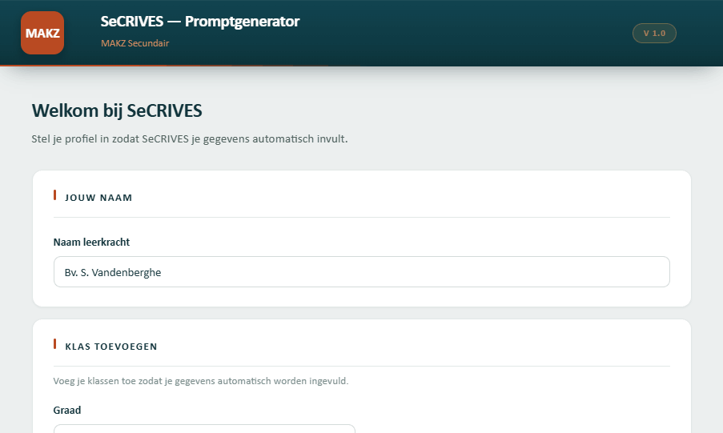

# ScrIVESCa — SeCRIVES voor MAKZ Secundair

> Promptgenerator voor leerkrachten in het secundair onderwijs. **Variant** van [SeCRIVES](https://github.com/vdammario-wq/scrivest) (Johannes De Doper-College), aangepast aan de huisstijl en het studieaanbod van **MAKZ Secundair**.

## Wat is dit?

Een **zelfstandig HTML-bestand** dat leerkrachten helpt om AI-prompts samen te stellen voor lesmateriaal, oefeningen, rubrics, evaluaties en interactieve HTML-apps. De gegenereerde prompt plak je vervolgens in Claude, ChatGPT of Gemini.

De app draait **volledig offline** in de browser — geen server, geen account, geen tracking. Alle gegevens (jouw profiel, klassen, leerplandoelen) blijven lokaal in `localStorage`.

## Gebruik

### Online (GitHub Pages)

1. Activeer GitHub Pages voor deze repo: **Settings → Pages → Branch: `main` / root**.
2. Open `https://vdammario-wq.github.io/scrivesca/`.
3. De app installeert zich als PWA — klik in Chrome/Edge op het install-icoon naast de URL voor een offline-versie op je dock.

### Lokaal

Download `index.html` (samen met `manifest.webmanifest`, `sw.js` en de icons) en open het in je browser. Een dubbelklik volstaat — er is geen build-stap.

> 💡 Voor de service worker te laten registreren moet je via `http(s)://` serveren (bv. `python3 -m http.server`). Bij rechtstreeks `file://`-openen werkt de app prima, alleen zonder offline-cache.

## Structuur

| Bestand                  | Doel                                          |
|--------------------------|-----------------------------------------------|
| `index.html`             | De volledige app (één bestand).               |
| `manifest.webmanifest`   | PWA-manifest (installeerbaar maken).          |
| `sw.js`                  | Service worker (offline cache).               |
| `icon-192.png`, `icon-512.png` | App-icons.                            |
| `screenshot.png`         | Schermafbeelding voor deze README.            |
| `CHANGELOG.md`           | Wijzigingsgeschiedenis.                       |

## Variant aanmaken voor een andere school

De app leest in zijn standalone-versie geen externe config — huisstijl en studieaanbod zitten ingebakken. Om een nieuwe variant te maken: fork deze repo en pas in `index.html` aan:

- **Branding:** `brandSub`, `brandDisc`, footer-tekst, `<title>`, en de `MAKZ`-tekst in `brandMono`.
- **Kleuren:** CSS-variabelen `--coral`, `--coral-fill`, `--coral-soft`, `--gold` in `:root`, plus de gerelateerde `rgba(...)`-waarden.
- **Studieaanbod:** de `RICHTINGEN`-constante.
- **Documentopmaak in prompts:** `JDD_HUISSTIJL`, de header/footer-blokken in de prompt-generatie en `appInstructie()`.

## Erkenningen

- Gebaseerd op **OneScrIVES** © 2026 Mario Van Dam.
- **SeCRIVES**: secundair-onderwijsvariant voor Johannes De Doper-College Brugge.
- **ScrIVESCa**: MAKZ Secundair-variant.

## Licentie

Geen open-source licentie — **alle rechten voorbehouden**. Neem contact op met de auteur voor gebruik buiten MAKZ Secundair.
